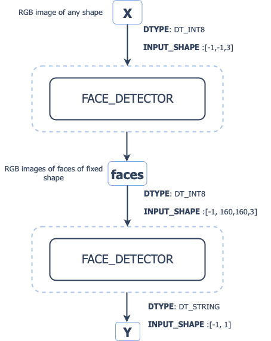

# Face detection and face recognition pipeline
This model consists of two stages:
1. face detection - detecting faces in img
2. face recognition - classifying faces (uses [facenet](https://github.com/davidsandberg/facenet) model for face embeddings and KNN classifier trained on [lfw dataset](http://vis-www.cs.umass.edu/lfw/))

## Pipeline structure:


## Face detection: 
- [Model contract](models/face_detection_model/serving.yaml) - contains deployment configuration
- [Signature function](models/face_detection_model/src/func_main.py) - entry point of model servable

### Deployment
```commandline
cd models/face_detection_model
hs upload
```

## Face recognition:
- [Model contract](models/facenet_model/serving.yaml) - contains deployment configuration
- [Signature function](models/facenet_model/src/func_main.py) - entry point of model servable
- [LFW_KNN_Classifier](models/facenet_model/lfw_classifier.pkl)
- [Pretrained facenet model](models/facenet_model/20180402-114759.pb)

### Load model 
Data is managed using [dvc](https://github.com/iterative/dvc). To load data you have to:
 - install and configure  awscli: [Installation guide](https://docs.aws.amazon.com/cli/latest/userguide/cli-chap-install.html)
     - Warning: do not forget to configure credentials for your aws account in awscli: you need to create a user
 - install `dvc[s3]` to manage s3 remote cache
 - pull necessary data from dvc:
```commandline
dvc pull models/facenet_model/20180402-114759.pb.dvc
```

### Deployment
```commandline
cd models/facenet_model
hs upload
```
